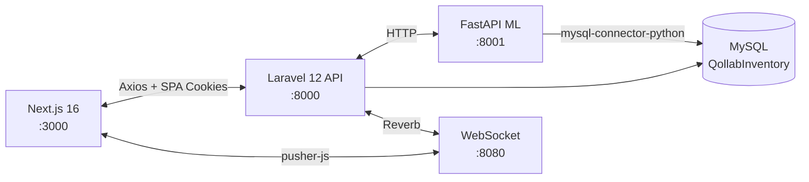

# Qollab


> AI-powered enterprise inventory management system with demand forecasting, supplier lead-time prediction, and full-cycle procurement-to-sales workflows.

## Quick Start

```bash
# 1. Backend
cd backend && cp .env.example .env && composer install
php artisan key:generate && npm install
# Edit .env: set DB_DATABASE, DB_USERNAME, DB_PASSWORD
mysql -u root -p -e "CREATE DATABASE IF NOT EXISTS QollabInventory;"
php artisan migrate --seed && php artisan storage:link

# 2. Frontend
cd ../frontend && cp .env.example .env.local && npm install
# Edit .env.local: set NEXT_PUBLIC_REVERB_APP_KEY to match backend

# 3. Run (two terminals minimum)
cd ../backend && composer dev     # Terminal 1 — API + queue + Vite
cd ../frontend && npm run dev     # Terminal 2 — Next.js on :3000

# 4. Optional: ML service
cd ../ml-service && python -m venv venv && .\venv\Scripts\Activate.ps1
pip install -r requirements.txt
uvicorn main:app --port 8001 --reload
```

### Ports at a Glance

| Service | Default Port |
|---|---|
| Laravel API | `http://localhost:8000` |
| Next.js Frontend | `http://localhost:3000` |
| Laravel Reverb (WebSocket) | `ws://localhost:8080` |
| FastAPI ML Service | `http://localhost:8001` |
| MySQL | `localhost:3306` |

---

## Table of Contents

- [Overview](#overview)
- [Tech Stack](#tech-stack)
- [Prerequisites](#prerequisites)
- [Project Structure](#project-structure)
- [Installation \& Setup](#installation--setup)
  - [Step 1 — Clone the Repository](#step-1--clone-the-repository)
  - [Step 2 — Environment Configuration](#step-2--environment-configuration)
  - [Step 3 — Backend Setup](#step-3--backend-setup)
  - [Step 4 — Database Setup](#step-4--database-setup)
  - [Step 5 — AI/ML Service Setup](#step-5--aiml-service-setup)
  - [Step 6 — Frontend Setup](#step-6--frontend-setup)
  - [Step 7 — Running the Application](#step-7--running-the-application)
- [Default Credentials / Test Accounts](#default-credentials--test-accounts)
- [API Documentation](#api-documentation)
- [Scheduled Jobs \& Background Workers](#scheduled-jobs--background-workers)
- [Troubleshooting](#troubleshooting)
- [Running Tests](#running-tests)
- [Deployment](#deployment)
- [Contributing](#contributing)
- [License](#license)

---

## Overview

Qollab is a full-stack, modular inventory management platform built for small-to-medium enterprises. It combines a **Laravel 12** REST API, a **Next.js 16** dashboard SPA, and a **FastAPI** machine-learning micro-service into a single cohesive system.

The platform covers the entire inventory lifecycle — from procurement (purchase orders, supplier management) through warehousing (multi-warehouse stock tracking, adjustments) to sales (orders, invoices, payments). An AI/ML service provides **demand forecasting** using Facebook Prophet and **supplier lead-time prediction** using scikit-learn Random Forest models, enabling proactive reorder decisions and automated low-stock alerts.

Key features include role-based access control (Admin / Manager / Staff / Guest) with granular per-resource permissions, real-time WebSocket notifications via Laravel Reverb, PDF export for purchase orders and invoices (via DomPDF), a comprehensive reporting and analytics dashboard (inventory valuation, sales performance, supplier scorecards, audit logs), and end-to-end dark/light theme support.

### Architecture



### Key Features

- **Inventory Management** — Products, categories, units, multi-warehouse stock levels, stock adjustments & receiving
- **Procurement** — Purchase orders with status workflow (Draft → Submitted → Confirmed → Received / Cancelled), bulk PO creation, PDF export
- **Sales** — Customers, sales orders (Pending → Confirmed → Shipped → Delivered / Cancelled), invoicing, payment tracking
- **Supplier Management** — Supplier CRUD, product-supplier linking, supplier performance metrics
- **AI/ML Forecasting** — Demand prediction (Prophet), lead-time prediction (Random Forest), automated stockout alerts
- **Real-time Notifications** — WebSocket push via Laravel Reverb, in-app notification center
- **Reports & Analytics** — Dashboard KPIs, inventory valuation, sales performance, low-stock, audit logs, supplier performance, inventory forecast
- **RBAC** — Role-based access with granular permissions per resource and action
- **Dark/Light Theme** — Full theme support via next-themes

---

## Tech Stack

| Layer | Technology | Version |
|---|---|---|
| **Frontend Framework** | Next.js (App Router) | 16.2.3 |
| **UI Library** | React | 19.2.4 |
| **Styling** | Tailwind CSS | 4.x |
| **Component Library** | shadcn/ui (Radix Nova) | 4.3.0 |
| **State Management** | Zustand | 5.x |
| **Data Fetching** | TanStack React Query | 5.x |
| **Tables** | TanStack React Table | 8.x |
| **Forms** | React Hook Form + Zod | 7.x / 4.x |
| **Charts** | Recharts | 3.x |
| **E2E Testing** | Playwright | 1.59.x |
| **Backend Framework** | Laravel | 12.x |
| **PHP** | PHP | ≥ 8.2 |
| **Authentication** | Laravel Sanctum (SPA cookies) | 4.x |
| **WebSockets** | Laravel Reverb | 1.10.x |
| **PDF Generation** | barryvdh/laravel-dompdf | 3.x |
| **Backend Testing** | Pest PHP | 3.x |
| **Database** | MySQL | 8.0+ |
| **Queue Driver** | Database | — |
| **ML Framework** | FastAPI | ≥ 0.110 |
| **Demand Forecasting** | Facebook Prophet | ≥ 1.1.5 |
| **Lead-Time Prediction** | scikit-learn (Random Forest) | ≥ 1.4.1 |
| **ML Data** | pandas | ≥ 2.2.1 |
| **Python** | Python | ≥ 3.10 |
| **Load Testing** | Artillery | — |

---

## Prerequisites

Install the following tools before proceeding. Verify each with the command shown.

| Tool | Min. Version | Verify Command | Download |
|---|---|---|---|
| **Node.js** | 20.x LTS | `node --version` | [nodejs.org](https://nodejs.org/) |
| **npm** | 10.x | `npm --version` | Bundled with Node.js |
| **PHP** | 8.2 | `php --version` | [php.net](https://www.php.net/downloads) |
| **Composer** | 2.x | `composer --version` | [getcomposer.org](https://getcomposer.org/) |
| **MySQL** | 8.0 | `mysql --version` | [dev.mysql.com](https://dev.mysql.com/downloads/) |
| **Python** | 3.10 | `python --version` | [python.org](https://www.python.org/downloads/) |
| **pip** | 22.x | `pip --version` | Bundled with Python |
| **Git** | 2.x | `git --version` | [git-scm.com](https://git-scm.com/) |

> **Windows users**: Use WSL2, Git Bash, or PowerShell. The commands below use Unix-style syntax — adjust path separators where needed.
>
> **macOS users**: Install PHP via Homebrew (`brew install php`). MySQL can be installed via `brew install mysql`.

---

## Project Structure

```
Qollab/
├── backend/                    # Laravel 12 API
│   ├── app/
│   │   ├── Console/Commands/   # Artisan commands (forecast checks)
│   │   ├── Http/               # Base controller, middleware
│   │   ├── Jobs/               # Queued jobs (ML model training)
│   │   ├── Models/             # Eloquent models (Auth, Inventory, Purchase, Sales, Supplier, Analytics)
│   │   ├── Modules/            # Domain modules (Auth, Inventory, PurchaseOrder, Sales, Supplier, Notification, Analytics)
│   │   ├── Notifications/      # Notification classes
│   │   ├── Policies/           # Authorization policies
│   │   ├── Providers/          # Service providers
│   │   └── Shared/             # Shared middleware (permission guard)
│   ├── bootstrap/              # App bootstrap & providers
│   ├── config/                 # Framework config (cors, sanctum, reverb, etc.)
│   ├── database/
│   │   ├── factories/          # Model factories
│   │   ├── migrations/         # 26 migration files
│   │   └── seeders/            # 11 seeder files (roles, users, products, etc.)
│   ├── routes/                 # api.php, web.php, console.php, channels.php
│   ├── tests/                  # Pest PHP tests (Feature & Unit)
│   ├── composer.json
│   └── .env.example
├── frontend/                   # Next.js 16 SPA
│   ├── app/                    # App Router pages (dashboard, auth, etc.)
│   ├── components/             # React components (UI, domain, shared)
│   ├── hooks/                  # Custom React hooks
│   ├── lib/                    # API clients, utilities, auth, echo
│   ├── types/                  # TypeScript type definitions
│   ├── e2e/                    # Playwright E2E tests
│   ├── package.json
│   └── .env.local
├── ml-service/                 # FastAPI ML micro-service
│   ├── main.py                 # FastAPI entry point
│   ├── models/                 # Demand & lead-time predictor modules
│   ├── requirements.txt
│   └── venv/                   # Python virtual environment (local)
└── load-testing/               # Artillery load test scenarios & results
    ├── backend-scenarios.yml
    └── ml-service-scenarios.yml
```

---

## Installation & Setup

### Step 1 — Clone the Repository

```bash
git clone https://github.com/shivammodi0807/inventoryManagement.git
cd inventoryManagement
```

<!-- TODO: Update the clone URL if the repository is hosted elsewhere. -->

---

### Step 2 — Environment Configuration

#### Backend (`backend/.env`)

Copy the example and fill in required values:

```bash
cd backend
cp .env.example .env
```

| Variable | Description | Example Value | Required | Where to Obtain |
|---|---|---|---|---|
| `APP_NAME` | Application display name | `Qollab` | Yes | Set to your project name |
| `APP_KEY` | Encryption key (auto-generated) | `base64:...` | Yes | Generated by `php artisan key:generate` |
| `APP_URL` | Backend base URL | `http://localhost:8000` | Yes | Must include `:8000` for signed URLs |
| `APP_DEBUG` | Enable debug mode | `true` | Yes | Set `false` in production |
| `FRONTEND_URL` | Next.js SPA origin (CORS) | `http://localhost:3000` | Yes | Must match your frontend URL |
| `DB_DATABASE` | Database name | `QollabInventory` | Yes | Create this DB manually |
| `DB_USERNAME` | Database user | `root` | Yes | Your MySQL user |
| `DB_PASSWORD` | Database password | _(empty for local)_ | Yes | Your MySQL password |
| `SESSION_DOMAIN` | Cookie domain scope | _(empty)_ | Yes | **Must be empty** for localhost cross-port auth |
| `SESSION_SECURE_COOKIE` | HTTPS-only cookies | `false` | Yes | Set `true` in production |
| `SANCTUM_STATEFUL_DOMAINS` | Domains receiving session cookies | `localhost:3000,127.0.0.1:3000` | Yes | Must include frontend host |
| `BROADCAST_CONNECTION` | Broadcast driver | `reverb` | Yes | Set to `log` to disable WebSockets |
| `REVERB_APP_ID` | Reverb application ID | `100001` | Yes | Any numeric ID |
| `REVERB_APP_KEY` | Reverb app key | _(random string)_ | Yes | Generate with `openssl rand -hex 16` |
| `REVERB_APP_SECRET` | Reverb app secret | _(random string)_ | Yes | Generate with `openssl rand -hex 16` |
| `ML_SERVICE_URL` | FastAPI ML service URL | `http://localhost:8001` | Optional | Change if ML service runs elsewhere |
| `MAIL_MAILER` | Mail driver | `log` | Optional | Use `smtp` for real email |
| `MAIL_HOST` | SMTP host (if using smtp) | `smtp.gmail.com` | Optional | Your SMTP provider |
| `MAIL_USERNAME` | SMTP username | `your-email@gmail.com` | Optional | Your email |
| `MAIL_PASSWORD` | SMTP password | `your-app-password` | Optional | Google: App Passwords (requires 2FA) |

```env
# backend/.env — minimal required overrides
APP_NAME=Qollab
APP_URL=http://localhost:8000
FRONTEND_URL=http://localhost:3000

DB_DATABASE=QollabInventory
DB_USERNAME=root
DB_PASSWORD=

SANCTUM_STATEFUL_DOMAINS=localhost:3000,127.0.0.1:3000,localhost:8000,127.0.0.1:8000
BROADCAST_CONNECTION=reverb
REVERB_APP_ID=100001                       # Any numeric ID
REVERB_APP_KEY=your-generated-app-key      # Run: openssl rand -hex 16
REVERB_APP_SECRET=your-generated-secret    # Run: openssl rand -hex 16
```

#### Frontend (`frontend/.env.local`)

```bash
cd ../frontend
```

Copy the example and set the Reverb app key:

```bash
cp .env.example .env.local
```

```env
NEXT_PUBLIC_API_URL="http://localhost:8000"

# Laravel Reverb (WebSocket) — must match backend .env values
NEXT_PUBLIC_REVERB_APP_KEY="your-reverb-app-key"  # Must match backend REVERB_APP_KEY
NEXT_PUBLIC_REVERB_HOST="localhost"
NEXT_PUBLIC_REVERB_PORT="8080"
NEXT_PUBLIC_REVERB_SCHEME="http"
```

| Variable | Description | Example Value | Required |
|---|---|---|---|
| `NEXT_PUBLIC_API_URL` | Laravel API base URL | `http://localhost:8000` | Yes |
| `NEXT_PUBLIC_REVERB_APP_KEY` | Must match `REVERB_APP_KEY` in backend | _(same as backend)_ | Yes |
| `NEXT_PUBLIC_REVERB_HOST` | Reverb host | `localhost` | Yes |
| `NEXT_PUBLIC_REVERB_PORT` | Reverb port | `8080` | Yes |
| `NEXT_PUBLIC_REVERB_SCHEME` | `http` or `https` | `http` | Yes |

#### ML Service

The ML service connects directly to MySQL using `mysql-connector-python`. The backend communicates with it via `ML_SERVICE_URL` (defined in `config/services.php`, defaults to `http://localhost:8001`). No separate `.env` file is needed for the ML service itself.

---

### Step 3 — Backend Setup

```bash
cd backend

# Install PHP dependencies
composer install

# Generate application encryption key
php artisan key:generate

# Install Node.js dependencies (for Vite asset build & Reverb)
npm install

# Create the public/storage → storage/app/public symlink (required for product images)
php artisan storage:link
```

---

### Step 4 — Database Setup

```bash
# 1. Create the MySQL database
mysql -u root -p -e "CREATE DATABASE IF NOT EXISTS QollabInventory CHARACTER SET utf8mb4 COLLATE utf8mb4_unicode_ci;"

# 2. Run all migrations (26 migration files in chronological order)
php artisan migrate

# 3. Seed the database (roles, permissions, users, categories, units, suppliers, warehouses, products)
php artisan db:seed

# — OR — run both in one command (destructive: drops all tables first)
php artisan migrate:fresh --seed
```

**Seeder execution order** (defined in `DatabaseSeeder.php`):
1. `RoleSeeder` — Creates Admin, Guest, Manager, Staff roles
2. `PermissionSeeder` — Creates granular permissions per resource
3. `RolePermissionSeeder` — Maps permissions to roles
4. `UserSeeder` — Creates 3 test accounts (see [Default Credentials](#default-credentials--test-accounts))
5. `UnitSeeder` — Units of measurement
6. `CategorySeeder` — Product categories
7. `SupplierSeeder` — Sample suppliers
8. `WarehouseSeeder` — Sample warehouses
9. `ProductSeeder` — Sample products with stock levels

> **Note**: `HistoricalDataSeeder` exists but is **not** called by `DatabaseSeeder`. Run it manually if you need historical sales/order data for ML training:
> ```bash
> php artisan db:seed --class=HistoricalDataSeeder
> ```

---

### Step 5 — AI/ML Service Setup

```bash
cd ml-service

# Create a Python virtual environment
python -m venv venv

# Activate the virtual environment
# Linux/macOS:
source venv/bin/activate
# Windows (PowerShell):
.\venv\Scripts\Activate.ps1
# Windows (CMD):
.\venv\Scripts\activate.bat

# Install Python dependencies
pip install -r requirements.txt
```

**Dependencies installed**: FastAPI, Uvicorn, pandas, Prophet, scikit-learn, Pydantic, mysql-connector-python, python-dotenv.

> **Note on Prophet**: Prophet uses `cmdstanpy` as its backend. If installation fails:
> ```bash
> pip install cmdstanpy
> python -c "import cmdstanpy; cmdstanpy.install_cmdstan()"
> pip install prophet
> ```
> On Windows, you may need to install [Microsoft C++ Build Tools](https://visualstudio.microsoft.com/visual-cpp-build-tools/) first.

No model weights need to be downloaded — models are trained at runtime from database data and saved as `.pkl` files in `ml-service/trained_models/`.

---

### Step 6 — Frontend Setup

```bash
cd frontend

# Install dependencies
npm install
```

No additional code-generation steps are needed. The shadcn/ui components are already committed to the repository under `components/ui/`.

---

### Step 7 — Running the Application

#### Option A — Run All Services Manually

Open **five** terminal windows (Terminal 5 and 6 are optional):

```bash
# Terminal 1 — Backend API (http://localhost:8000)
cd backend
php artisan serve

# Terminal 2 — Queue Worker (processes background jobs)
cd backend
php artisan queue:listen --tries=1

# Terminal 3 — WebSocket Server (ws://localhost:8080)
cd backend
php artisan reverb:start

# Terminal 4 — Frontend Dev Server (http://localhost:3000)
cd frontend
npm run dev

# Terminal 5 (optional) — ML Service (http://localhost:8001)
cd ml-service
source venv/bin/activate   # or .\venv\Scripts\Activate.ps1 on Windows
uvicorn main:app --host 0.0.0.0 --port 8001 --reload

# Terminal 6 (optional) — Scheduler (runs daily forecast checks & ML training)
cd backend
php artisan schedule:work
```

> **Shortcut**: The backend `composer dev` script starts three sub-processes concurrently — the API server, queue worker, and Vite asset watcher. **It does not start Reverb or the scheduler** — those must be launched separately if needed.
> ```bash
> cd backend
> composer dev           # Starts server + queue + Vite
> php artisan reverb:start  # Separate terminal for WebSockets
> ```
> You still need to start the frontend and ML service in their own terminals.

#### Option B — Docker Compose

<!-- TODO: No docker-compose.yml was found in the repository. Add one if containerized deployment is needed. -->

Docker Compose is not currently configured for this project.

#### Option C — Available Scripts

**Backend** (`composer.json` scripts):

| Command | Description |
|---|---|
| `composer dev` | Starts API server + queue worker + Vite concurrently |
| `composer setup` | Full setup: install, env copy, key:generate, migrate, npm build |
| `composer test` | Runs Pest PHP test suite |

**Frontend** (`package.json` scripts):

| Command | Description |
|---|---|
| `npm run dev` | Starts Next.js dev server on port 3000 |
| `npm run build` | Production build |
| `npm run start` | Serves production build |
| `npm run lint` | Runs ESLint |
| `npm run test:e2e` | Runs Playwright E2E tests |
| `npm run test:e2e:ui` | Opens Playwright UI mode |

---

## Default Credentials / Test Accounts

These accounts are created by `UserSeeder` when you run `php artisan db:seed`:

| Role | Email | Password |
|---|---|---|
| **Admin** | `admin@qollab.com` | `password` |
| **Manager** | `manager@qollab.com` | `password` |
| **Staff** | `staff@qollab.com` | `password` |

All seeded accounts have pre-verified email addresses and can log in immediately.

> ⚠️ **Change these credentials** before deploying to any non-local environment.

---

## API Documentation

The backend exposes a RESTful API prefixed with `/api`. Authentication uses Laravel Sanctum SPA cookie-based sessions. All protected routes require a prior call to `GET /sanctum/csrf-cookie`.

### Core Endpoints

> This is a representative subset. See the module route files in `backend/app/Modules/*/routes.php` for the complete API.

**Authentication & Users**

| Method | Endpoint | Description | Auth |
|---|---|---|---|
| `POST` | `/api/login` | Authenticate user (session cookie) | No |
| `POST` | `/api/register` | Self-service signup (Guest role) | No |
| `POST` | `/api/logout` | Destroy session | Yes |
| `GET` | `/api/user` | Current user profile | Yes |
| `POST` | `/api/password/forgot` | Request password reset email | No |
| `POST` | `/api/password/reset` | Reset password with token | No |
| `POST` | `/api/email/verify/{id}/{hash}` | Verify email (signed URL) | No |
| `GET` | `/api/users` | List users (admin) | Yes |
| `GET` | `/api/roles` | List roles | Yes |

**Inventory**

| Method | Endpoint | Description | Auth |
|---|---|---|---|
| `GET` | `/api/products` | List products (paginated) | Yes |
| `POST` | `/api/products` | Create product | Yes |
| `GET` | `/api/products/low-stock` | Products below reorder point | Yes |
| `POST` | `/api/products/{id}/adjust` | Adjust stock levels | Yes |
| `POST` | `/api/products/{id}/receive` | Receive stock | Yes |
| `GET` | `/api/warehouses` | List warehouses | Yes |
| `GET` | `/api/categories` | List categories | Yes |

**Procurement**

| Method | Endpoint | Description | Auth |
|---|---|---|---|
| `GET` | `/api/purchase-orders` | List purchase orders | Yes |
| `POST` | `/api/purchase-orders` | Create purchase order | Yes |
| `POST` | `/api/purchase-orders/quick-create` | Quick-create from low-stock | Yes |
| `POST` | `/api/purchase-orders/bulk` | Bulk-create POs | Yes |
| `PATCH` | `/api/purchase-orders/{id}/submit` | Submit for approval | Yes |
| `PATCH` | `/api/purchase-orders/{id}/confirm` | Approve PO | Yes |
| `POST` | `/api/purchase-orders/{id}/receive` | Receive stock from PO | Yes |
| `GET` | `/api/purchase-orders/{id}/export` | Export PO as PDF | Yes |

**Sales**

| Method | Endpoint | Description | Auth |
|---|---|---|---|
| `GET` | `/api/sales/orders` | List sales orders | Yes |
| `POST` | `/api/sales/orders` | Create sales order | Yes |
| `POST` | `/api/sales/orders/{id}/confirm` | Confirm order | Yes |
| `POST` | `/api/sales/orders/{id}/ship` | Mark as shipped | Yes |
| `POST` | `/api/sales/orders/{id}/deliver` | Mark as delivered | Yes |
| `POST` | `/api/sales/orders/{orderId}/invoice` | Generate invoice | Yes |
| `GET` | `/api/sales/invoices/{id}/export` | Export invoice as PDF | Yes |

**Suppliers, Notifications & Reports**

| Method | Endpoint | Description | Auth |
|---|---|---|---|
| `GET` | `/api/suppliers` | List suppliers | Yes |
| `GET` | `/api/suppliers/{id}/performance` | Supplier performance metrics | Yes |
| `GET` | `/api/notifications` | List notifications | Yes |
| `GET` | `/api/dashboard/stats` | Dashboard summary KPIs | Yes |
| `GET` | `/api/reports/inventory-valuation` | Inventory valuation report | Yes |
| `GET` | `/api/reports/sales-performance` | Sales performance report | Yes |
| `GET` | `/api/reports/inventory-forecast` | AI-driven forecast report | Yes |
| `GET` | `/api/reports/export/{type}` | Export report as CSV/PDF | Yes |

### ML Service Endpoints

| Method | Endpoint | Description |
|---|---|---|
| `GET` | `/health` | Health check |
| `POST` | `/train/demand` | Train demand forecasting model for a product |
| `POST` | `/train/lead-time` | Train lead-time model for a supplier |
| `POST` | `/predict` | Get demand predictions for a product |

### Permission System

All protected endpoints use a `permission:action,resource` middleware. Actions are `view`, `create`, `edit`, `delete`, plus domain-specific ones like `receive` (for purchase orders). Example: `permission:edit,product` guards stock adjustment routes.

The four seeded roles have these default access levels:

| Role | Access Level |
|---|---|
| **Admin** | Full access to all resources (sealed — cannot be deleted) |
| **Manager** | CRUD on inventory, suppliers, purchase orders; read on all |
| **Staff** | Read-only access to operational data |
| **Guest** | Default for new signups — no permissions until admin grants them |

---

## Scheduled Jobs & Background Workers

The application uses Laravel's scheduler and database queue:

| Schedule | Command / Job | Description |
|---|---|---|
| Daily at 08:00 | `inventory:check-forecasts` | Scans for products predicted to stock out within 7 days and notifies Admins/Managers |
| Daily at 02:00 | `TrainPredictiveModels` (queued job) | Retrains demand and lead-time models for all active products/suppliers via the ML service |

To run the scheduler locally:

```bash
cd backend
php artisan schedule:work
```

The queue worker must be running to process the `TrainPredictiveModels` job:

```bash
php artisan queue:listen --tries=1
```

### ML Data Pipeline

The `TrainPredictiveModels` job (dispatched daily at 02:00 via the scheduler) iterates all active products and suppliers. For each, it calls the FastAPI ML service via HTTP (`ML_SERVICE_URL`). The ML service reads historical sales/order data directly from MySQL via `mysql-connector-python`, trains a Prophet (demand) or RandomForest (lead-time) model, and returns predictions. The Laravel backend stores these predictions in the `predictions` table, which powers the dashboard forecast widgets and stockout alerts.

---

## Troubleshooting

| # | Error | Cause | Fix |
|---|---|---|---|
| 1 | `SQLSTATE[HY000] [1049] Unknown database 'QollabInventory'` | Database not created | `mysql -u root -p -e "CREATE DATABASE QollabInventory;"` |
| 2 | `CSRF token mismatch` | Frontend not sending cookies properly | Ensure `SANCTUM_STATEFUL_DOMAINS` includes `localhost:3000` and `SESSION_DOMAIN` is empty or `localhost` |
| 3 | `CORS: No 'Access-Control-Allow-Origin'` | `FRONTEND_URL` mismatch | Set `FRONTEND_URL=http://localhost:3000` in backend `.env` |
| 4 | `419 Page Expired` on login | Missing CSRF cookie | Ensure frontend calls `GET /sanctum/csrf-cookie` before `POST /api/login` |
| 5 | `Vite manifest not found` | Backend Vite assets not built | Run `cd backend && npm run build` |
| 6 | `Connection refused` on port 8080 | Reverb not running | Run `php artisan reverb:start` or set `BROADCAST_CONNECTION=log` to disable |
| 7 | `ModuleNotFoundError: No module named 'prophet'` | Prophet not installed | Run `pip install prophet` inside the venv. On Windows, install C++ Build Tools first |
| 8 | `ERROR: No matching distribution found for prophet` | Python version too old or missing dependencies | Use Python 3.10+. Try: `pip install pystan==2.19.1.1 && pip install prophet` |
| 9 | Frontend shows blank page / 500 | API unreachable | Verify `NEXT_PUBLIC_API_URL` matches the running backend URL |
| 10 | `Permission denied` errors in dashboard | User role lacks permission | Log in as `admin@qollab.com` or grant permissions via Settings → Roles |

---

## Running Tests

### Backend Tests (Pest PHP)

```bash
cd backend
php artisan test
# — or —
./vendor/bin/pest
```

Tests use an **in-memory SQLite** database (configured in `phpunit.xml`), so your MySQL data is not affected.

### Frontend E2E Tests (Playwright)

```bash
cd frontend

# Install Playwright browsers (first time only)
npx playwright install

# Run all E2E tests (starts dev server automatically)
npm run test:e2e

# Run with interactive UI
npm run test:e2e:ui
```

Playwright is configured with three test projects:
- **guest** — Unauthenticated user tests (`*.guest.spec.ts`)
- **admin** — Admin user tests (`*.admin.spec.ts`)
- **staff** — Staff user tests (`*.staff.spec.ts`)

### Frontend Linting

```bash
cd frontend
npm run lint
```

### Load Testing (Artillery)

```bash
# Install Artillery globally
npm install -g artillery

# Run backend load tests
cd load-testing
artillery run backend-scenarios.yml

# Run ML service load tests
artillery run ml-service-scenarios.yml
```

---

## Deployment

### Environment Variables to Change for Production

```env
# backend/.env
APP_ENV=production
APP_DEBUG=false
APP_URL=https://your-domain.com
FRONTEND_URL=https://app.your-domain.com
SANCTUM_STATEFUL_DOMAINS=app.your-domain.com
SESSION_SECURE_COOKIE=true
SESSION_DOMAIN=.your-domain.com
REVERB_SCHEME=https
```

```env
# frontend/.env.local
NEXT_PUBLIC_API_URL=https://your-domain.com
NEXT_PUBLIC_REVERB_SCHEME="https"
NEXT_PUBLIC_REVERB_HOST="your-domain.com"
```

### Build Commands

```bash
# Backend — optimize for production
cd backend
composer install --no-dev --optimize-autoloader
php artisan config:cache
php artisan route:cache
php artisan view:cache
npm run build

# Frontend — production build
cd frontend
npm run build
npm run start   # or deploy the .next/ output to Vercel / Node server
```

### Reverse Proxy (Nginx)

A reverse proxy is recommended to serve the backend, frontend, and WebSocket connections under a single domain. Key points:
- Proxy `/api/*` and `/sanctum/*` to the Laravel backend (port 8000)
- Proxy WebSocket upgrades on port 8080 for Reverb
- Serve the Next.js app on the root domain or a subdomain
- Enable HTTPS with valid SSL certificates

---

## Contributing

1. **Fork** the repository
2. **Create** a feature branch: `git checkout -b feature/your-feature`
3. **Commit** your changes: `git commit -m "feat: add your feature"`
4. **Push** to the branch: `git push origin feature/your-feature`
5. **Open** a Pull Request against `main`

Please ensure:
- All existing tests pass (`composer test` and `npm run test:e2e`)
- New features include appropriate tests
- PHP code is formatted with Pint: `cd backend && ./vendor/bin/pint`
- TypeScript code passes ESLint: `cd frontend && npm run lint`

---

## License

This project is licensed under the **MIT License**. See the `LICENSE` file for details.
